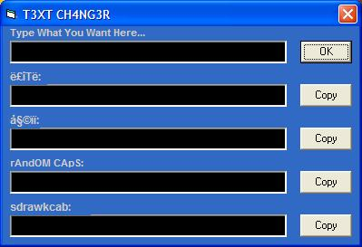



## T3XT CH4NG3R

### Description

converts text to ë£îTë, 姩ïï, rAndOM CApS and Backwards
 
### More Info
 

             |
---                |---
**Submitted On**   |2004-07-10 08:54:04
**By**             |[FL1PP3R](https://github.com/Planet-Source-Code/PSCIndex/blob/master/ByAuthor/fl1pp3r.md)
**Level**          |Beginner
**User Rating**    |3.0 (12 globes from 4 users)
**Compatibility**  |VB 6\.0
**Category**       |[Miscellaneous](https://github.com/Planet-Source-Code/PSCIndex/blob/master/ByCategory/miscellaneous__1-1.md)
**World**          |[Visual Basic](https://github.com/Planet-Source-Code/PSCIndex/blob/master/ByWorld/visual-basic.md)
**Archive File**   |[T3XT\_CH4NG1768027102004\.zip](https://github.com/Planet-Source-Code/fl1pp3r-t3xt-ch4ng3r__1-54855/archive/master.zip)

